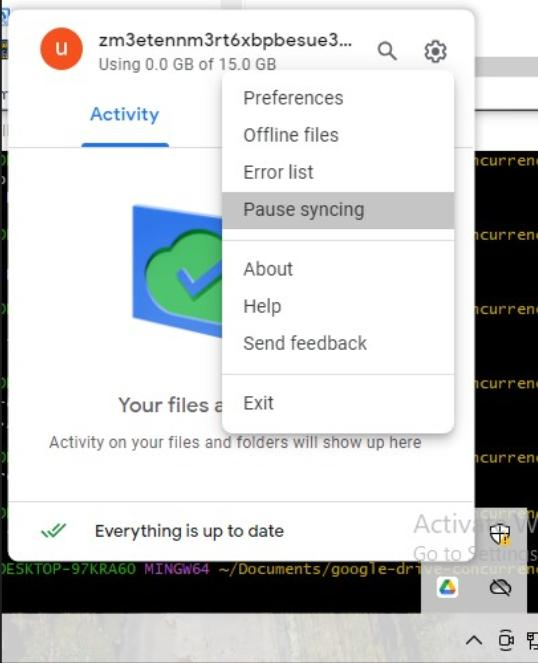

# Google Drive concurrency test

This repository enables to test Google Drive behavior
in the face of concurrent operations from two sites.

This is nothing fancy, simply three python scripts creating, renaming and deleting files
and folders.
But the use of scripts offers a reproduceable test with with little hand work,
so less human errors, and serves as reference of what was exactly tested.

## Usage

Install the Google Drive client on two machines and connect them to the same test
account.

Clone this repository.

Follow the instructions in .env.example to create your own environment.

On one site, run `python setup.py`.

Make sure the created files and directories are synchronized on the two sites before
continuing.

Disable synchronization either by using the Google Drive desktop option "Pause syncing" (see image below)
or by disconnecting internet.

 \
*Google Drive's "Pause Syncing" option*

Run `python site_1.py` on site 1 and  `python site_2.py` on site 2.

Reconnect both machines and wait for them to synchronize.

Explore the results. You can have a look to the scripts to see all the tested scenarios.
